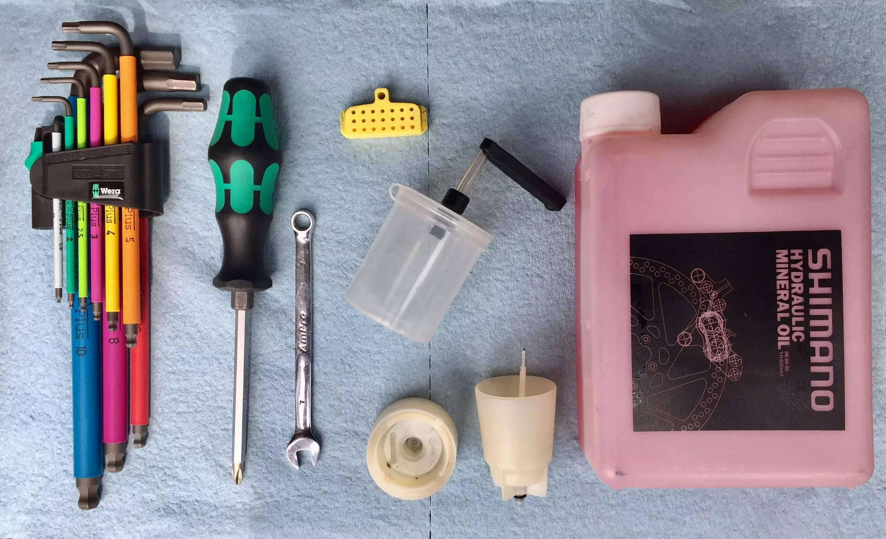

# How to Bleed Moutain Bike Brakes
## When do you need to bleed your brakes?
If you bike brakes has been feeling a little extra squishy lately or your brake lever seems to pull in diffrent amounts as you ride; you may need to bleed your brakes. 

## The Tools You Need
 
* Set of Allen Keys
* Brake Bleed Kit
* Wrench Set(depending on the type of caliper you have)
* Brake Oil(of course)

## Lets Get Started
### 1. First make the brake lever parallel to the ground
* Use the allen key to loosed the bolt and raise the brake levers to where they are parallel to the ground and retighten the bolt
* This is to make sure you spill as little oil as possible and allow for all air bubbles to escape.
 

### 2. Remove brake pads and insert bleed block
* Remove the cotter pin holding in the brake pads and insert the bleed block
* Be sure to set the brake pads out the way for now so they don't get contaminated with any mineral oil. If the brake pads get contaminated, they won't have the same stopping power as before. 
 

### 3. First make the brake lever parallel to the ground
* Use the allen key to loosed the bolt and raise the brake levers to where they are parallel to the ground and retighten the bolt
* This is to make sure you spill as little oil as possible and allow for all air bubbles to escape.
 

### 4. Fill up the bleed cup and screw it into your lever
* Use a 2.5mm Allen key to remove the brake lever cap screw on top of the lever reservoir. Be sure not to lose the rubber O-ring at the base of the cap screw.

* Fill the bleed cup with the correct brake Oil and screw it into the brake lever.

 

### 5. Attach oil catch bottle to the bleed nipple on the caliper
* Press the rubber oil line on to the bleed port fitting near the top brake caliper bolt. Make sure to push the line all the way on to the fitting so that no air can get in and no oil can get out.
 

### 6. Open the brake system at the lever and caliper
* Pull the stopper out of the bleed cup
* Loosen the bleed nipple on the caliper 
* Brake fluid will flow from the highest point to the lowest point, make sure that the bleed cup never runs out of oil. 
 

### 7. Close the brake caliper bleed port
* Once you see no more air bubbles coming out, close the brake caliper bleed port.
* Then put the stopper back into the bleed cup and remove the bleed cup from the lever. 

### 8. Clean and reattach the brake pads
* WIPE OFF excess oil from the caliper to prevent contamination of the brake pads
* Then reassemble the pads onto the caliper. 

### 9. Go Shred Some Trails Now
